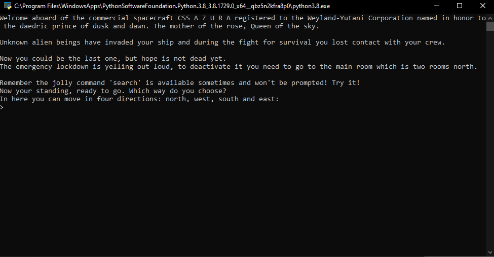
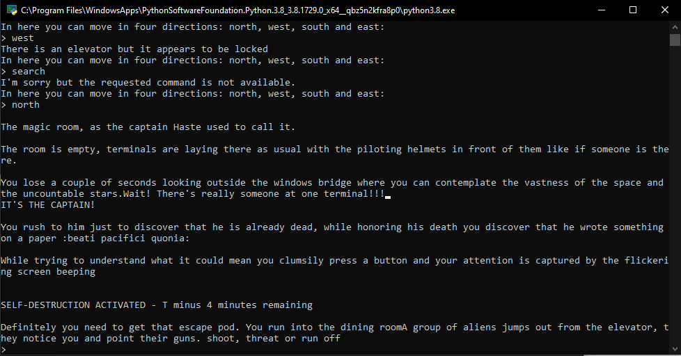
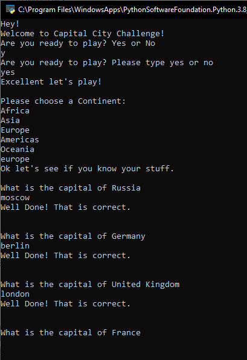
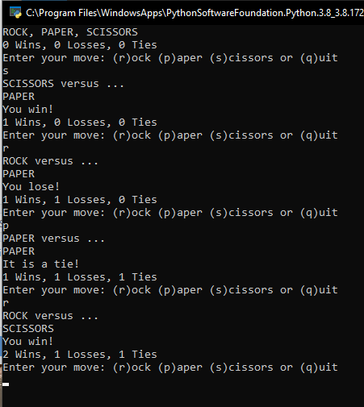

# showcase
Exercises to get acquainted with python

## Summerfield
- Some exercises from the [book](https://www.goodreads.com/book/show/4988121-programming-in-python-3)

## Azura
- Text adventure

## Capitals
- Quiz with all the capitals of the world

## Sweigart
- Some exercises from the [book](https://automatetheboringstuff.com/)

